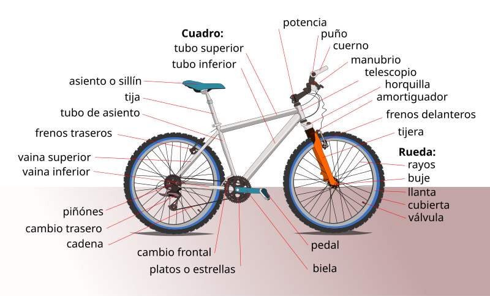

# Todo sobre bicicletas
> Menú de opciones y descripción de la página, además de imagen de referencia y tabla para su comprensíon.

- Bicicletas
- Componentes y accesorios
- Marcas
- Ofertas

De acuerdo con la Real Academia de la Lengua Española la bicicleta es un **"vehículo de dos ruedas, normalmente de igual tamaño, cuyos
pedales transmiten el movimiento a la rueda trasera por medio de un plato, un piñón y una cadena”.**

Los componentes principales de una bicicleta se pueden agrupar en tres categorías: la estructura, la transmisión y los periféricos.

| Costos	       | Componetes                                                                    |
| ----------     | --------------------------------------------------------------------------    |
| Estructura	   | Cuadro, horquilla, caja de pedalier, tirantes, vainas, tija, sillín, ruedas   |
| Transmisión	   | Bielas, platos, cassette, cadena, desviadores                                 |
| Periféricos	   | Manubrio, frenos, pedal, accesorios como timbres, portabidones, luces         |

## Imagenes
>Catálogo de imágenes con descripción para una mayor comprensión de lo que se ofrece.

Scott se caracteriza principalmente por la espectacularidad de sus diseños. La marca suiza es una de las más prestigiosas y respetadas en el
mundo del ciclismo. Algo que valoran sus usuarios es la estética que le dan a sus modelos.

Lo que encontrarás con Trek es que todos sus modelos son de muy alta calidad, sobre todo al usar componentes desarrollados por ellos mismos.
Será la elección correcta si buscás la seguridad de comprar de una marca líder del mercado.

Las bicicletas Santa Cruz potencian las habilidades de los atletas profesionales y ciclistas aficionados de todo el mundo gracias a sus
diseños líderes en la industria. La marca específica para MTB es famosa por su innovación y su estilo creativo , y siempre se ciñe a un 
catálogo relativamente pequeño en el que solo los mejores modelos pasan la prueba.

Las bicicletas Specialized se encuentran, sin lugar a dudas, entre las mejores del sector . Las bicicletas de montaña de Specialized se 
encuentran entre las más avanzadas del mercado.

Cannondale es una excelente marca para los que busquen una buena bicicleta de aluminio o aquellos que busquen una bicicleta cómoda 
para salidas largas.

### Dudas y/o sugerencias
> Creación de formulario para generar una comunicación entre el usuario de la pagina y el autor de la misma para obtener comentarios, dudas y/o sugencias.
<form>
        
            <label for="nombre">Nombre:</label>
            <input type="text" id="nombre">   
        
            <label for="apellidos">Apellidos:</label>
            <input type="text" id="apellidos">  

            <label for="motivo">Motivo del mensaje:</label>
            <input type="text" id="motivo">  
        
            <label for="email">Email:</label>
            <input type="text" id="email">  
           
            <button type="submit">Registrar cita</button>
  </form>

_Contáctanos al 1234567890 o envia un correo a ejemplo@gmail.com_

### Autores
> Proyecto de HTML para uso de etiquetas semánticas, títulos, párrafos, imágenes, listas, control de versiones con git y repositorio en GitHub,
> además de incluir archivo README.md y publicación de proyecto mediante GitHub pages para publicar y acceder al mismo.

|[Jessica Bernal Anzures](https://github.com/Jessica-Bernal)|
